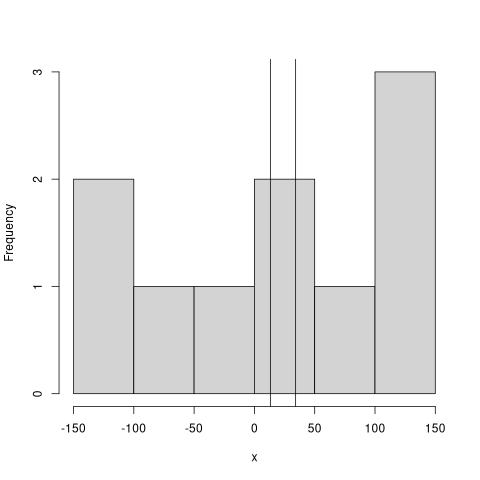

# Aktuelles

## Ergebnisse HA auf Mittwoch

Wir haben vergessen, die genauen Ergenbisse der HA auf heute anzugeben.

* arithmetisches Mittel 13,23
* Median 34,2
* Beide Werte liegen ziemlich in der Mitte. Es handelt sich um eine Verteilung, die nicht extrem schief ist (s. Histogramm). Daher ist das arithmetische Mittel hier vorzuziehen. 

## Checkliste

Ich habe die am 2025-10-14 ausgeteilte [Checkliste](mathe/mitschriften_und_texte/checkliste1.pdf) hochgeladen.

# Über dieses Verzeichnis

Hier findet sich das Übungs- und Unterrichtsmaterial für Mathematik und Physik für die 9. Klasse.

Alles, was vielleicht etwas technisch aussieht, könnt Ihr ignorieren, wichtig sind die Ordner, in denen ihr die Dateien findet, die ihr braucht.

Wer der Meinung ist, dass etwas fehlt, meldet sich gerne über [felix.golcher@fs-mahlsdorf.de](mailto:felix.golcher@fs-mahlsdorf.de) oder über Edupage. Über Fehlerkorrekturen freue ich ebenfalls sehr.
